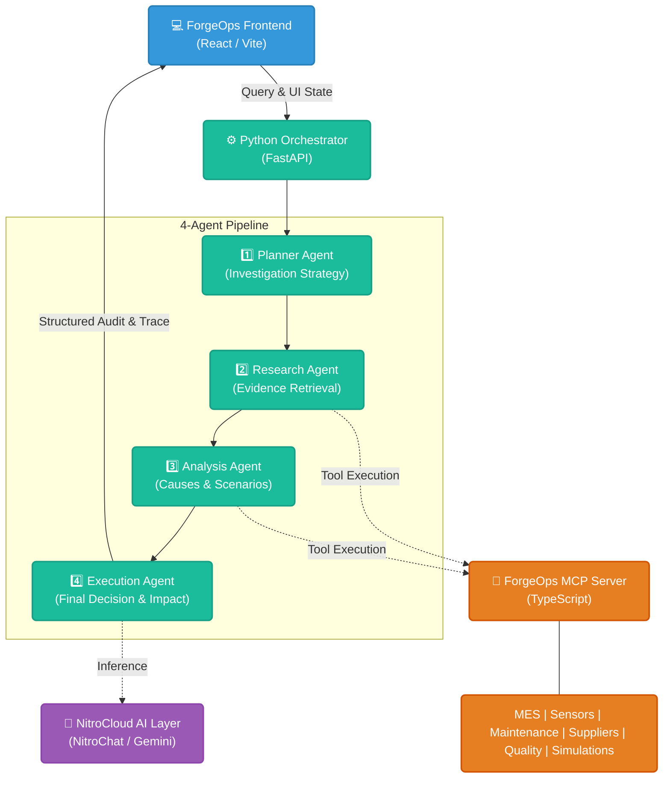

# ForgeOps — An agentic AI orchestrator for real-time manufacturing root-cause analysis

> ForgeOps is an explainable, multi-agent manufacturing decision-intelligence platform that turns fragmented factory data into evidence-backed corrective actions.

  

**ForgeOps** is an [MCP (Model Context Protocol)](https://nitrostack.ai) powered platform that extends AI assistants with real-world manufacturing capabilities. It solves a critical industry problem: conventional monitoring systems detect faults but cannot explain their root causes, compare interventions, or show engineers why an AI's decision should be trusted.

## 🔗 Live Links
- **🌐 Live Web Application:** [https://zen-net-forgeops.vercel.app/](https://zen-net-forgeops.vercel.app/)
- **🚀 Hosted MCP Endpoint:** `https://zenops-6a649dab-zen-net-amrita-university-coimbatore.app.nitrocloud.ai`

## Table of Contents
- [Overview](#overview)
- [System Architecture](#system-architecture)
- [The Web Application](#the-web-application)
- [The Agentic Pipeline](#the-agentic-pipeline)
- [The ForgeOps MCP Server](#the-forgeops-mcp-server)
- [Getting Started (Local Dev)](#getting-started-local-dev)
- [License](#license)

---

## Overview

ForgeOps is not merely an LLM connected to a dashboard. It is an evidence-grounded, multi-agent decision system. It reconstructs production incidents, synchronizes anomalies across the manufacturing timeline, distinguishes symptoms from root causes, and compares possible actions by yield recovery, cost, effort, downtime, and confidence. 

Every conclusion includes transparent evidence references, assumptions, agent execution status, and a live MCP tool trace. Human approval remains the final gate before any operational recommendation is acted upon.

---

## System Architecture



---

## The Web Application

The **ForgeOps Workbench** is a modern, responsive React web application built with Vite and TypeScript. It acts as the command center for factory operators.

**Key Technical Features:**
- **Real-Time Agent Tracing:** As the Python backend orchestrates the agents, the UI updates to show exactly which agent is working, what MCP tools they are calling, and what evidence they have found.
- **Interactive Root Cause Graph:** A dynamic D3/SVG graph that visually maps causality (e.g., how a humidity spike led to a calibration drift, causing a yield drop).
- **What-If Simulator:** Interactive sliders allow operators to adjust factory parameters (like Machine Queue Times or Temperature) and instantly see predicted yield recovery and financial impact.
- **Evidence-Backed UI:** Every recommendation is linked to specific documents, sensors, or historical batches retrieved by the MCP server.

---

## The Agentic Pipeline

ForgeOps uses a linear, specialized **4-Agent Pipeline** built in Python. Instead of relying on a single prompt, the system routes the investigation through four distinct phases:

1. **Planner Agent:** 
   - **Role:** Evaluates the user's query and the current UI context.
   - **Action:** Formulates a strict, multi-step investigation strategy and determines the exact user intent.
2. **Research Agent:** 
   - **Role:** The data gatherer.
   - **Action:** Takes the plan and uses MCP tools to retrieve concrete evidence (sensor telemetry, maintenance logs, historical batches, SOPs).
3. **Analysis Agent:** 
   - **Role:** The diagnostician.
   - **Action:** Ingests the retrieved evidence, correlates anomalies across the manufacturing timeline, builds the causal graph, and evaluates counterfactual scenarios.
4. **Execution Agent:** 
   - **Role:** The synthesizer.
   - **Action:** Takes the analysis and formulates the final operational recommendation. It calculates expected business impact (yield recovery vs. downtime cost) and structures the data for the React UI.

---

## The ForgeOps MCP Server

The intelligence of the agents is grounded by the **ForgeOps MCP Server**, written in TypeScript. It acts as a unified API layer that exposes 16 specific operations (11 direct tools, 5 workflows) across five core manufacturing domains:

- **🏭 MES (Manufacturing Execution System):** Tools to pull active batch statuses, route histories, and equipment queues.
- **🔍 Quality:** Tools to retrieve defect logs, inspection reports, and historical yield data.
- **🔧 Maintenance:** Tools to access machine health metrics, vibration telemetry, and past service logs.
- **📦 Materials:** Tools to check supplier constraints, inventory levels, and material specifications.
- **🔄 Simulation:** A dedicated digital-twin engine that allows agents to run "What-If" scenarios to predict the outcome of interventions before they are applied on the factory floor.

---

## Getting Started (Local Dev)

### Prerequisites
- Node.js 18+ 
- Python 3.10+
- An MCP-compatible client (Claude Desktop, Cursor, etc.)

### Installation

Clone the repository:
```bash
git clone https://github.com/shalcoder/ZenOps.git
cd ZenOps
```

**1. Start the MCP Server:**
```bash
cd forgeops-mcp
npm install
npm run dev
```

**2. Start the Python Orchestrator Backend:**
```bash
cd backend
pip install -r requirements.txt
cp .env.example .env # Add your keys here
python main.py
```

**3. Start the Frontend Workbench:**
```bash
# From the project root
npm install
npm run dev
```

## License

MIT © 2026 Zennet

---

Built with ❤️ using the Model Context Protocol on [Nitrostack](https://nitrostack.ai). Share your MCP app on [r/mcptothemoon](https://www.reddit.com/r/mcptothemoon/).
